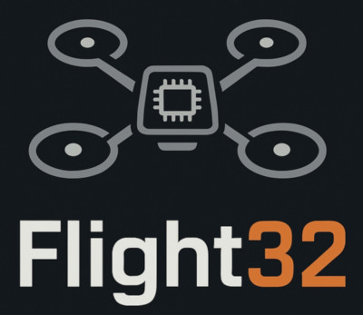

# Flight32: Open-Source ESP32 Flight Controller Firmware

<div align="center">
  
</div>

<p align="center">
  <strong>Welcome to Flight32 – a robust, extensible, and user-friendly firmware for your ESP32-based flight controller.</strong>
  <br>
  Dive into the world of precise flight control and unlock the full potential of the ESP32 in your next drone project.
</p>

---

## ✨ Why Choose Flight32?

*   🚀 **Peak Performance & Stability**: Experience ultra-stable flight thanks to a real-time FreeRTOS-based scheduler that guarantees reliable and predictable performance.
*   🧠 **Dual-Core Powerhouse**: We harness the full power of the ESP32's dual-core architecture, dedicating one core to flight-critical tasks and the other to communications and user interaction.
*   🧩 **Clean & Modular Architecture**: Our object-oriented design makes the firmware easy to understand, modify, and extend. Add new sensors or features without getting lost in a maze of code.
*   📊 **Real-time Insights**: Tune and debug on the fly with a powerful, built-in terminal. Monitor CPU load, loop times, and memory usage to squeeze every drop of performance out of your hardware.
*   👩‍💻 **Professional Terminal Experience**: Enjoy a dynamic, bash-like prompt, character echo, and backspace support for a more intuitive and professional interaction with your flight controller.

---

## 🚀 Core Features

### ✈️ Flight & Control
*   **MPU6050 IMU Integration**: Get reliable attitude and heading data with our seamless MPU6050 integration. Includes on-the-fly calibration.
*   **Flysky IBUS Receiver Support**: Rock-solid connection to your Flysky receiver using the IBUS protocol.
*   **DShot Motor Control**: Precise and efficient motor control using the ESP32's RMT peripheral and DShot300 protocol.
*   **PID Controller**: A full PID controller for flight stabilization with easily adjustable gains via the terminal.

### ⚙️ System & Configuration
*   **Persistent Settings**: Your settings are automatically saved to non-volatile storage (NVS), so they're retained even after a reboot.
*   **Advanced Task Management**: Our custom scheduler provides detailed insights into task performance, helping you identify bottlenecks and optimize your system.
*   **Centralized Configuration**: All major hardware and task parameters are centralized in `src/config.h` for easy customization.

---

## 💻 Terminal Commands

Our interactive terminal gives you complete control over your flight controller. Here are some of the available commands (type `help` in the terminal for a full list):

<details>
  <summary><strong>System Commands</strong></summary>
  
  *   `help`           - Shows the main help message or help for a specific category.
  *   `status`         - Displays firmware version and system status.
  *   `tasks`          - Provides a detailed list of all running tasks, including CPU usage, loop times, and stack memory.
  *   `mem`            - Shows current memory usage.
  *   `reboot`         - Reboots the flight controller.
  *   `factory_reset confirm` - Resets all settings to their default values.
</details>

<details>
  <summary><strong>Sensor & IMU Commands (MPU6050)</strong></summary>
  
  *   `get mpu.data`   - Displays the latest accelerometer, gyroscope, and temperature readings.
  *   `get mpu.config` - Shows the current sensor configuration.
  *   `set mpu.calibrate`  - Starts the gyro calibration routine.
</details>

<details>
  <summary><strong>Receiver Commands (IBUS)</strong></summary>
  
  *   `get ibus.data`  - Shows the latest channel data from your receiver.
  *   `get ibus.status`- Shows the connection status.
</details>

<details>
  <summary><strong>Motor Commands</strong></summary>
  
  *   `set motor.throttle <id> <throttle>` - Sets the throttle for a specific motor (e.g., `set motor.throttle 0 1000`).
</details>

<details>
  <summary><strong>PID Tuning Commands</strong></summary>
  
  *   `get pid`        - Gets the current PID gains for all axes.
  *   `set pid <axis> <p|i|d> <value>` - Sets a specific PID gain (e.g., `set pid roll p 20`).
  *   `reset pid confirm` - Resets all PID gains to their default values.
</details>

<details>
  <summary><strong>Settings & Configuration Commands</strong></summary>
  
  *   `get <key>`      - Gets the value of a specific setting.
  *   `set <key> <value>`- Sets a new value for a setting.
  *   `dump`           - Dumps all settings in a parsable format for backup.
  *   `save`           - Saves all current settings to persistent storage.
</details>

---

## 🏁 Quick Start

Get your drone in the air in just a few minutes:

1.  **Install Board Support**: Make sure you have the ESP32 board package installed in your Arduino environment.
2.  **Compile & Upload**: Open `flight32.ino` in the Arduino IDE, select your board and port, and hit upload.
    
    *Or, use the Arduino CLI for a faster workflow:*
    ```bash
    # Compile the firmware
    arduino-cli compile --fqbn esp32:esp32:esp32 flight32.ino

    # Upload to your flight controller
    arduino-cli upload -p <Your_Port> --fqbn esp32:esp32:esp32 flight32.ino
    ```

---

## 💡 What's Next?

Flight32 is an actively developed project. Here's a glimpse of what's on the horizon:
*   Integration of more advanced sensors (e.g., barometer, magnetometer).
*   Implementation of different flight modes (e.g., Acro, Angle, Horizon).
*   Support for more receiver and ESC protocols.

---

## 🤝 Contribute

Have an idea or a bug fix? We welcome all contributions! Your input helps make Flight32 the best open-source flight controller firmware available.

---

**Flight32**
